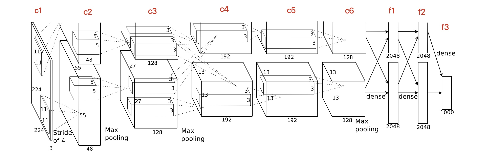
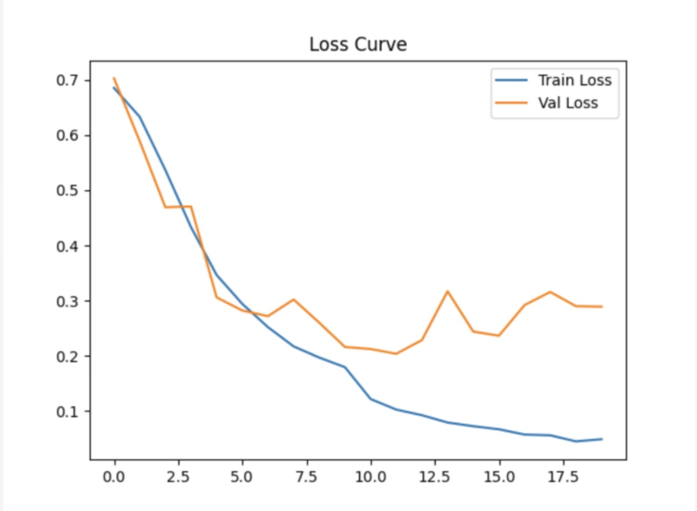

# Cat vs Dog Classifier with AlexNet

This project is a simple but complete implementation of **AlexNet** for binary image classification (cats vs dogs) using PyTorch.

## Dataset

The dataset is downloaded from Kaggle:  
[Dog and Cat Classification Dataset](https://www.kaggle.com/datasets/bhavikjikadara/dog-and-cat-classification-dataset)  
It was split into training, validation, and testing sets with the following structure:

## 📂 Project Structure

```
cat-dog-classifier/
│
├── data/ # Organized dataset: train / val / test
│   ├── train/
│   ├── val/
│   └── test/
│
├── net.py # AlexNet model definition
├── split_data.py # Downloads and splits the raw Kaggle dataset
├── train.py # Training and validation pipeline
├── requirements.txt # Python dependencies
└── README.md # This file
```

## Features

- Custom AlexNet-based CNN for binary classification
- Dataset downloaded via [kagglehub](https://github.com/kagglehub/kagglehub)
- Train/Val/Test split with corrupted image removal
- GPU/CPU compatible training
- Live training progress bar (via `tqdm`)
- Model checkpoint saving (`best_model.pth`, `last_model.pth`)
- Matplotlib visualization of loss and accuracy

## Setup

1. **Create virtual environment**  
    ```bash
    python -m venv newenv
    source newenv/bin/activate
    ```

2. **Install dependencies**
    ```bash
    pip install -r requirements.txt
    ```

3. **Download and split dataset**
    ```bash
    python split_data.py
    ```

4. **Train model**
    ```bash
    python train.py
    ```

## Model Architecture

Our implementation follows the classic AlexNet design, with 5 convolutional layers (`c1`–`c5`) and 3 fully connected layers (`f6`–`f8`), using ReLU activations and `MaxPool2d` for downsampling.

Dropout is only applied **between fully connected layers**, as originally proposed. This aligns with the intuition that fully connected layers are more prone to overfitting due to their large number of parameters.

📌 Reference architecture:



## Results

- Final **training accuracy**: ~98%
- Final **validation accuracy**: ~91%
- Some overfitting appears after epoch 16

📉 Training vs Validation Loss:



### Observations

- Loss drops steadily in training but plateaus and slightly increases on validation.
- This typical **overfitting pattern** suggests that generalization could be improved.
- Possible strategies: early stopping, weight decay, or more aggressive dropout.

## Next Steps

- Add `EarlyStopping` or `ReduceLROnPlateau`
- Experiment with deeper networks (e.g., ResNet18)
- Try regularization strategies like batch normalization or L2 penalty
- Export to ONNX for efficient inference

## Credits

- Dataset: [Kaggle Dog-and-Cat Classification Dataset](https://www.kaggle.com/datasets/bhavikjikadara/dog-and-cat-classification-dataset)
- Architecture Reference:  
  Krizhevsky, A., Sutskever, I., & Hinton, G. E. (2012).  
  *ImageNet Classification with Deep Convolutional Neural Networks*.  
  NIPS 2012. [Link](https://proceedings.neurips.cc/paper_files/paper/2012/file/c399862d3b9d6b76c8436e924a68c45b-Paper.pdf)

---

**Note:** This project is the first in a series of hands-on experiments. More advanced topics like network optimization and architectural tuning will be explored after all foundational projects are complete.